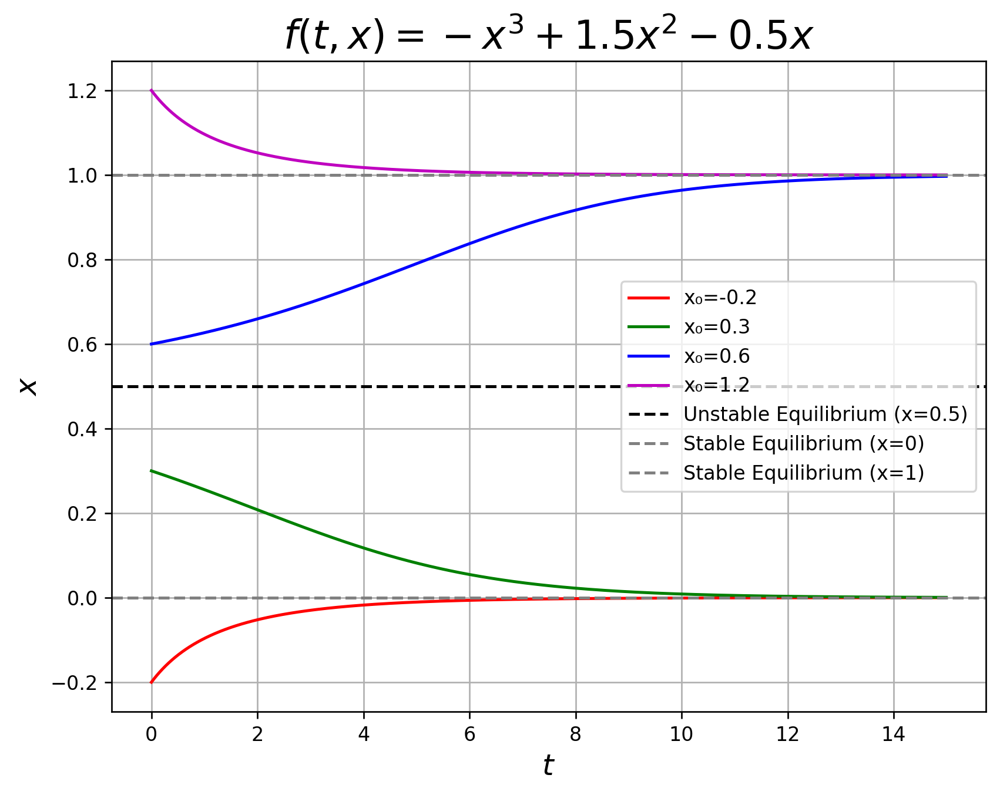

---

marp: true
theme: academic
paginate: false
style: |
  .container {
    display: flex;
    width: 100%;
    height: 100%;
    justify-content: space-between;
    gap: 100px;
  }
  .column {
    flex: 1;
    padding: 0 0px;
  }
  img[alt~="center"] {
    display: block;
    margin: 0 auto;
  }
  svg[id^="mermaid-"] { 
    min-width: 550px; 
    max-width: 960px; 
    min-height: 400px; 
    max-height: 500px;
  }

---
<!-- _class: lead -->

<!--  -->
<!--  -->

<h1 style="color: white;"> GENERATING MUSIC VARIATIONS </h1>

through Chaotic Dynamical Systems Exploration

 

 

Wannasa Rianthong  
Kanatsanun Sub-udom   
Patipan Somwong

 

 

Prof. Ratthaprom Promkam  
Prof. Pakeeta Sukprasert  
Prof. Akarate Singta

 

<!-- **17 January 2025** -->

---

<!-- header: Project Overview -->

 
 
 
 
<h1> Project Overview </h1>

---

---

---

<!-- header: Preliminary -->

 
 
 
 
<h1> Preliminary </h1>

---

#### Dynamical System

A continuous dynamical system is represented by a set of ordinary differential equations:
$$ \dot{x}(t) = f(t, x(t)), $$
where $x(t) \in \mathbb{R}^n$ and $f: \mathbb{R} \times \mathbb{R}^n \to \mathbb{R}^n$. Additionally,
$$
\dot{x}(t) = \begin{bmatrix} x_1^\prime(t) \\ x_2^\prime(t) \\ \vdots \\ x_n^\prime(t) \end{bmatrix}
\quad \text{and} \quad
f(t, x(t)) = \begin{bmatrix} f_1(t, x_1(t), x_2(t), \ldots, x_n(t)) \\ f_2(t, x_1(t), x_2(t), \ldots, x_n(t)) \\ \vdots \\ f_n(t, x_1(t), x_2(t), \ldots, x_n(t)) \end{bmatrix}.
$$

---

#### Numerical Solution

  

  

  

  <h5> Initial Value Problems </h5>

  $$
  \dot{x}(t) = f(t, x(t)), \quad x(t_0) = x_0,
  $$
  where $x(t_0)$ is an initial condition at time $t_0$.

  

---

#### Fourth-Order Runge-Kutta Method (RK4)

$$
{\scriptsize
\begin{aligned}
    x_0 &= x_n, \\
    k_1 &= h f(t_n, x_n), \\
    k_2 &= h f\left(t_n + \dfrac{h}{2}, x_n + \dfrac{k_1}{2} \right), \\
    k_3 &= h f\left(t_n + \dfrac{h}{2}, x_n + \dfrac{k_2}{2} \right), \\
    k_4 &= h f(t_n + h, x_n + k_3), \\
    x_{n+1} &= x_n + \dfrac{1}{6} (k_1 + 2k_2 + 2k_3 + k_4).
\end{aligned}
}
$$
Here, $h$ is the step size, $x_n$ is the approximation of $x(t_n)$ at step $n$, $f(t, x)$ represents the given differential equation. The initial condition is given by $x(t_0) = x_0$.

---

#### Stability

Equilibrium point $x^*$ are states where the system remains unchanged over time. These points satisfy:

$$
f(t, x^*) = 0.
$$

- If $x^*$ is stable, then the solution will approach $x^*$.
- If $x^*$ is unstable, then the solution will not approach $x^*$.

---

#### Stability

Let $f:\mathbb{R}^n \to \mathbb{R}^n$, the Jacobian matrix of $f$ at equilibrium point $x^* = (x_1,x_2,\dots,x_n)$ is
$$
{\scriptsize
\dfrac{\partial f}{\partial x}(x^*) = \begin{bmatrix} 
\dfrac{\partial f_1}{\partial x_1}(x^*) & \dfrac{\partial f_1}{\partial x_2}(x^*) & \cdots & \dfrac{\partial f_1}{\partial x_n}(x^*) \\  \\
\dfrac{\partial f_2}{\partial x_1}(x^*) & \dfrac{\partial f_2}{\partial x_2}(x^*) & \cdots & \dfrac{\partial f_2}{\partial x_n}(x^*)\\ 
\vdots & \vdots & \ddots &  \\  
\dfrac{\partial f_n}{\partial x_1}(x^*) & \dfrac{\partial f_n}{\partial x_2}(x^*) & \cdots & \dfrac{\partial f_n}{\partial x_n}(x^*)
\end{bmatrix}.
}
$$

---

#### Stability

The eigenvalues $\lambda$ are found by solving the equation:
$$
\begin{equation} \label{eq:detI}
    \det(\dfrac{\partial f}{\partial x}(x^*) - \lambda I) = 0,
\end{equation}
$$
where $I$ is an $n \times n$ identity matrix.

- If $Re(\lambda) < 0$ for all eigenvalue, then $x^*$ is stable.
- If $Re(\lambda) > 0$ for at least one eigenvalue, then $x^*$ is unstable.
- If $Re(\lambda) = 0$ for at least one eigenvalue, then the stability of $x^*$ cannot be determined.

---

#### Stability

---

#### Chaotic Dynamical System

  

  

  

One of the conditions for chaotic behavior in a continuous dynamical system is that **all equilibrium points are unstable.**

  

<!-- For an instance, there exists $\lambda = a \pm bi$ and $\lambda = -c$ where $a, b, c \in \mathbb{R_+}$ and $i$ is the imaginary unit. -->

---

#### Lorenz System
$$ 
\begin{aligned}
\dot{x}_1 &= \sigma(x_2 - x_1) \\
\dot{x}_2 &= \rho x_1 - x_2 - x_1x_3 \\
\dot{x}_3 &= x_1x_2 - \beta x_3
\end{aligned}
$$
Where parameters $\sigma > 0$, $\rho > 0$, $\beta > 0$ and equilibrium point:
$$
\begin{aligned}
x^*_1 &= (0, 0, 0), \\
x^*_2 &= x^*_3 = (\pm \sqrt{\beta (\rho - 1)}, \pm \sqrt{\beta (\rho - 1)}, \rho - 1).
\end{aligned}
$$
If $\sigma = 10$, $\rho = 28$ and $\beta = \dfrac{8}{3}$, it exhibits chaotic behavior.

---
#### Lorenz System with Chaotic Behavior

  

  <h6> Non-Chaotic </h6>

  

  

  <h6> Chaotic </h6>

  

---

<!-- header: Overview of Our Method -->

 
 
 
 
<h1> Overview of Our Method </h1>

---

---

---

---

---

---

---

---

---

---

---

---

---

---

---

---

---

---

---

---

---

---

Following the mapping, we obtain:

$$
\beta(\tilde{\phi}(kh)) :=
\begin{cases}
\alpha(\phi(b)) & \text{if } \exists a, b \in \text{dom }(\phi; m, h) \text{ s.t. } \phi(a) < \tilde{\phi}_1(kh) \leq \phi(b) \\
& \text{and } \nexists c \in \text{dom }(\phi; m, h) \text{ s.t. } \phi(a) < \phi(c) \leq \phi(b), \\
\alpha(\min\{\phi(t)\}) & \text{if } \tilde{\phi}_1(kh) < \phi(t) \text{ for all } t \in \text{dom }(\phi; m, h), \\
\alpha(\max\{\phi(t)\}) & \text{if } \phi(t) < \tilde{\phi}_1(kh) \text{ for all } t \in \text{dom }(\phi; m, h),
\end{cases}
$$
where 
$$
\begin{aligned}
\text{dom }(\phi; m, h) &= \{0, 0.01, 0.02, \dots, (m - 1)h\}
\end{aligned}
$$

---

<!-- header: Musical Variations from a Chaotic Mapping Method -->

 
 
 
 
<h1> Musical Variations from a Chaotic Mapping Method </h1>

---

#### 1.Given a sequence of musical pitches

 

  <h6>Original</h6>
   
  
   
  <audio controls>
    <source src="mp3/dabby_1.mp3" type="audio/mpeg">
  Your browser does not support the audio element.
  </audio>

$$ \{p_k\}_{k=0}^{10} = \{C4, C4, G4, G4, A4, A4, G4, F4, F4, E4, E4\} $$

---

#### 2.Determine a trajectory

$$
\begin{aligned}
\dot{x}_1 &= 10(x_2 - x_1) \\
\dot{x}_2 &= 28x_1 - x_2 - x_1x_3 \\
\dot{x}_3 &= x_1x_2 - 2.67x_3
\end{aligned}
\implies
\boxed{\begin{array}[c]
\text{RK4} \\
x_1(0) = x_2(0) = x_3(0) = 1.00 \\
h = 0.01
\end{array}}
$$

|       | $t = 0$ | $t = h$ | $t = 2h$ | $t = 3h$ | $t = 4h$ | $\dots$ | $t = 9h$ | $t =  10h$ |
| ----- | ------ | ------ | ------ | ------ | ------ | ------ | ------ | ------ |
| $k$ | 0 | 1 | 2 | 3 | 4 | $\dots$ | 9 | 10 |
| $x_1$ | 1.00 | 1.29 | 2.13 | 3.74 | 6.54 | $\dots$ | 7.55 | 1.20 | 
| $x_2$ | 1.00 | 2.40 | 4.47 | 7.96 | 13.73 | $\dots$ | -7.58 | -8.87 |
| $x_3$ | 1.00 | 0.96  | 1.11 | 1.82 | 4.18 | $\dots$ | 38.92 | 32.46 |

---

A numerical solution for the component $x_1$ is defined as:
$$
\begin{aligned} 
\{ \phi_1(kh) \}_{k=0}^{10} &= \{\phi_1(0), \phi_1(0.01), \phi_1(0.02), \phi_1(0.03), \phi_1(0.04), \phi_1(0.05), \\ 
& \quad \; \; \; \phi_1(0.06), \phi_1(0.07), \phi_1(0.08), \phi_1(0.09), \phi_1(0.1)\} \\
&= \{1.00, 1.29, 2.13, 3.74, 6.54, 11.04, 16.69, 19.56, 15.37, \\ 
& \quad \; \; \; 7.55, 1.20\},
\end{aligned}
$$

where $\phi_1:h\mathbb{N}_{10} \to \mathbb{R}$ and $\mathbb{N}_{10} = \{0, 1, 2, \dots, 10\}$.

---

#### 3.Construct a mapping $\alpha$

We define a mapping $\alpha$ as 
$$\alpha(\phi_1(kh)) = p_k,$$
where
$$
\begin{aligned}
\{ \phi_1(kh) \}_{k=0}^{10} &= \{1.00, 1.29, 2.13, 3.74, 6.54, 11.04, 16.69, 19.56, 15.37, \\ 
& \quad \; \; \; 7.55, 1.20\}, \\
\{p_k\}_{k=0}^{10} &= \{C4, C4, G4, G4, A4, A4, G4, F4, F4, E4, E4\}.
\end{aligned}
$$

---

---

#### 4.Alternate the initial condition

$$
\begin{aligned}
\dot{x}_1 &= 10(x_2 - x_1) \\
\dot{x}_2 &= 28x_1 - x_2 - x_1x_3 \\
\dot{x}_3 &= x_1x_2 - 2.67x_3
\end{aligned}
\implies
\boxed{\begin{array}[c]
\text{RK4} \\
{\color{blue}x_1(0) = 1.01}, x_2(0) = x_3(0) = 1.00 \\
h = 0.01
\end{array}}
$$

|       | $t = 0$ | $t = h$ | $t = 2h$ | $t = 3h$ | $t = 4h$ | $\dots$ | $t = 9h$ | $t =  10h$ |
| ----- | ------ | ------ | ------ | ------ | ------ | ------ | ------ | ------ |
| $k$ | 0 | 1 | 2 | 3 | 4 | $\dots$ | 9 | 10 |
| $x_1$ | 1.01 | 1.30 | 2.15 | 3.76 | 6.58 | $\dots$ | 7.48 | 1.15 | 
| $x_2$ | 1.00 | 2.41 | 4.50 | 8.00 | 13.80 | $\dots$ | -7.62 | -8.87 |
| $x_3$ | 1.00 | 0.97  | 1.12 | 1.83 | 4.22 | $\dots$ | 38.84 | 32.41 |

---

A new numerical solution for the component $x_1$ is defined as:
$$
\begin{aligned} 
\left\{\tilde{\phi}_1(kh) \right\}_{k=0}^{10} &= \{ \tilde{\phi}_1(0), \tilde{\phi}_1(0.01), \tilde{\phi}_1(0.02), \tilde{\phi}_1(0.03), \tilde{\phi}_1(0.04), \tilde{\phi}_1(0.05), \\ 
& \quad \; \; \tilde{\phi}_1(0.06), \tilde{\phi}_1(0.07), \tilde{\phi}_1(0.08), \tilde{\phi}_1(0.09), \tilde{\phi}_1(0.1) \} \\
&= \{ 1.01, 1.30, 2.15, 3.76, 6.58, 11.10, 16.73, 19.55, 15.30, \\
& \quad \; \; 7.48, 1.15 \},
\end{aligned}
$$

where $\tilde{\phi}_1:h\mathbb{N}_{10} \to \mathbb{R}$  and $\mathbb{N}_{10} = \{0, 1, 2, \dots, 10\}$.

---

#### 5.Construct a mapping $\beta$

We define a mapping $\beta$ as 
$$
\beta(\tilde{\phi}_1(kh)) :=
\begin{cases}
\alpha(\phi_1(b)) & \text{if } \exists a, b \in \text{dom }(\phi_1; 11, 0.01) \text{ s.t. } \phi_1(a) < \tilde{\phi}_1(kh) \leq \phi_1(b) \\
& \text{and } \nexists c \in \text{dom }(\phi_1; 11, 0.01) \text{ s.t. } \phi_1(a) < \phi_1(c) \leq \phi_1(b), \\
\alpha(\min\{\phi_1(t)\}) & \text{if } \tilde{\phi}_1(kh) < \phi_1(t) \text{ for all } t \in \text{dom }(\phi_1; 11, 0.01), \\
\alpha(\max\{\phi_1(t)\}) & \text{if } \phi_1(t) < \tilde{\phi}_1(kh) \text{ for all } t \in \text{dom }(\phi_1; 11, 0.01),
\end{cases}
$$
where 
$$
\begin{aligned}
\text{dom }(\phi_1; 11, 0.01) &= \{0, 0.01, 0.02, 0.03, 0.04, 0.05, 0.06, 0.07, 0.08, \\
& \quad \; \; \; 0.09, 0.1\}
\end{aligned}
$$

---

---

#### 6.Construct the sequence of new musical pitch

 

      <h6>Variation</h6>

$$      
\{\beta(\tilde{\phi}_1(kh)) \}_{k = 0}^{10} = \{E4, G4, G4, A4, E4, F4, F4, F4, F4, E4, E4\}.
$$
 

       
      <audio controls>
        <source src="mp3/dabby_2.mp3" type="audio/mpeg">
      Your browser does not support the audio element.
      </audio>

---

<!-- header: Musical Variations from a Expanded Rhythm Method -->

 
 
 
 
<h1> Musical Variations from a Expanded Rhythm Method </h1>

---

#### 1.Given a sequence of musical pitches

 

  <h6>Original</h6>
   
  
   
  <audio controls>
    <source src="mp3/dabby_1.mp3" type="audio/mpeg">
  Your browser does not support the audio element.
  </audio>

$$ \{p_k\}_{k=0}^{10} = \{C4, C4, G4, G4, A4, A4, G4, F4, F4, E4, E4\} $$

---

#### 2.Expanding the Rhythm of Musical Pitches

Consider the musical pitch sequence:  

$$ 
\{p_k\}_{k=0}^{10} = \{C4, C4, G4, G4, A4, A4, G4, F4, F4, E4, E4\} 
$$

If each musical pitch is expanded into two musical pitch, we obtain:
$$
\begin{aligned}
\{p^\prime_k\}_{k=0}^{21} &= \{C4, C4, C4, C4, G4, G4, G4, G4, A4, A4, A4, \\ 
& \quad \; \; \; A4, G4, G4, F4, F4, F4, F4, E4, E4, E4, E4\}
\end{aligned}
$$ 

---

#### 3. Expanded Musical Pitches $\rightarrow$ New Variation

---

#### 4.Construct the sequence of new musical pitch

$$
\begin{aligned}
\{ \beta(\tilde{\phi}_1(kh)) \}_{k=0}^{21} &= \{p^*_0, p^*_1, p^*_2, \dots, p^*_{21}\}\\
&= \{A4, C4, C4, G4, A4, A4, 
G4, G4, A4, A4, A4, \\ 
& \quad \; \; \; A4, 
G4, G4, F4, F4, F4, F4, 
E4, E4, F4, E4\} 
\end{aligned}
$$

$$
\Bigg\downarrow
$$

$$
\{p^*_{k^*}\}_{k^*=0}^{11}
$$

---

#### 4.Construct the sequence of new musical pitch

 

      <h6>Variation</h6>

$$\{p^*_{k}\}_{k=0}^{10} = \{A4, C4, C4, G4, A4, A4, G4, G4, A4, A4, A4\}$$

 

       
      <audio controls>
        <source src="mp3/er_c1.mp3" type="audio/mpeg">
      Your browser does not support the audio element.
      </audio>

---

#### 4.Construct the sequence of new musical pitch

 

      <h6>Variation</h6>

$$\{p^*_{k}\}_{k=11}^{21} = \{A4, G4, G4, F4, F4, F4, F4, E4, E4, E4, E4\}$$

 

       
      <audio controls>
        <source src="mp3/er_c2.mp3" type="audio/mpeg">
      Your browser does not support the audio element.
      </audio>

---

#### 4.Construct the sequence of new musical pitch

 

      <h6>Variation</h6>

$$\{p^*_{2k}\}_{k=0}^{10} = \{A4, C4, A4, G4, A4, A4, G4, F4, F4, E4, F4\}$$

 

       
      <audio controls>
        <source src="mp3/er_c3.mp3" type="audio/mpeg">
      Your browser does not support the audio element.
      </audio>

---

<!-- header: Python Library -->

 
 
 
 
<h1> Python Library </h1>

---

---

---

<!-- header: Web Application -->

 
 
 
 
<h1> Web Application </h1>

---

---

---

---

<!-- header: Showcases -->

 
 
 
 
<h1> Showcases </h1>

---

 
 
 
 

  Pachelbell - Canon In D

  

    

    <h6>Original</h6>
     
      <audio controls>
        <source src="mp3/Johann_Pachelbel_Canon_in_D_original.mp3" type="audio/mpeg">
        Your browser does not support the audio element.
      </audio>
    

  

  

    

    <h6>Variation</h6>
     
      <audio controls>
        <source src="mp3/Johann_Pachelbel_Canon_in_D_new.mp3" type="audio/mpeg">
        Your browser does not support the audio element.
      </audio>
    

  

---

 
 
 
 

  Yiruma, (이루마) - River Flows in You

  

    

    <h6>Original</h6>
     
      <audio controls>
        <source src="mp3/River_Flows_In_You_original.mp3" type="audio/mpeg">
        Your browser does not support the audio element.
      </audio>
    

  

  

    

    <h6>Variation</h6>
     
      <audio controls>
        <source src="mp3/River_Flows_In_You_new.mp3" type="audio/mpeg">
        Your browser does not support the audio element.
      </audio>
    

  

---

<!-- header: Backup -->

 
 
 
 
<h1> Backup </h1>

---

<!-- header: Example of Fourth Order Runge-Kutta -->

#### Example of Fourth Order Runge-Kutta

Consider the dynamical system $\dot{x}(t) = x$ with the initial condition $x_0 = 1$ at $t_0 = 0$. Using a fixed step size of $h = 0.1$, the numerical approximation of $x_1$ is given by:
$$
{\scriptsize
\begin{aligned}
x_{1} &= 1 + \frac{1}{6} (0.1 + 2(0.105) + 2(0.00525) + 0.100525) = 1.0701708, \\
k_1 & = 0.1 f(0, 1) = 0.1(1) = 0.1, \\
k_2 &= 0.1 f\left(0 + \frac{0.1}{2}, 1 + \frac{0.1}{2}\right) = 0.1(0.05, 1.05) = 0.1(1.05) = 0.105, \\
k_3 &= 0.1 f\left(0 + \frac{0.1}{2}, 1 + \frac{0.105}{2}\right) = 0.1 f(0.05, 0.0525) = 0.1(0.0525) = 0.00525, \\
k_4 &= 0.1 f(0 + 0.1, 1 + 0.00525) = 0.1 f(0.1, 1.00525) = 0.1(1.00525) = 0.100525.
\end{aligned}
}
$$

---

<!-- header: Chaotic System -->

### Chaotic System

- Aperiodic long-term behavior

- Deterministic

- Sensitive dependence on initial conditions

---

  

  <h3> Non-Chaotic </h3>

  

  

  <h3> Chaotic </h3>

  

---

<!-- header: Our Result -->

#### Musical Variations from a Chaotic Mapping Method

Consider a sheet music with $m$ being a positive integer representing the number of notes, and $\displaystyle\{p_k\}_{k=0}^{m-1}$ being a sequence of musical pitches. Let
$$
\begin{equation}
\dot{x}(t) = f(t,x)
\end{equation}
$$
define a chaotic dynamical system with an initial condition $x(0) = x_0 \in \mathbb{R}^n$, where $f: \mathbb{R}_{+} \times \mathbb{R}^n \to \mathbb{R}^n$ is a continuous function.

---

Given a sequence $\{\phi_i(kh)\}_{k=0}^{m-1}$, where $\phi_i:h\mathbb{N}_{m - 1} \to \mathbb{R}$ is a numerical solution in the $i$-th component of the chaotic dynamical system for some $i \in \mathbb{N}_n$ and a step size $h$, we define a mapping $\alpha$ as
$$
\begin{equation} \label{eq: gmap}
\alpha(\phi_i(kh)) := p_k
\end{equation}
$$
for all $k \in \{0\}\cup\mathbb{N}_{m-1}$. To generate a new variation of the music, we consider $\{\tilde{\phi}_i(kh)\}_{k=0}^{m-1}$ as a sequence of a new trajectory with the initial condition $x(0) = \tilde{x}_0 \in \mathbb{R}^n$, where $\tilde{\phi}_i$ is a numerical solution in the $i$-th component to the system \eqref{eq: odes}, and $\tilde{x}_0$ is located not far from $x_0$, i.e., $\left\lVert x_0 - \tilde{x}_0 \right\rVert \leq d$ for some small positive number $d \in \mathbb{R}$.

---

We then define another mapping $\beta$ as:
$$
\begin{equation} \label{eq:lmap}
\beta(\tilde{\phi}_i(kh)) :=
\begin{cases}
\alpha(\phi_i(b)) & \text{if } \exists a, b \in \text{dom }(\phi_i; m, h) \text{ s.t. } \phi_i(a) < \tilde{\phi}_i(kh) \leq \phi_i(b) \\
& \text{and } \nexists c \in \text{dom }(\phi_i; m, h) \text{ s.t. } \phi_i(a) < \phi_i(c) \leq \phi_i(b), \\
\alpha(\min\{\phi_i(t)\}) & \text{if } \tilde{\phi}_i(kh) < \phi_i(t) \text{ for all } t \in \text{dom }(\phi_i; m, h), \\
\alpha(\max\{\phi_i(t)\}) & \text{if } \phi_i(t) < \tilde{\phi}_i(kh) \text{ for all } t \in \text{dom }(\phi_i; m, h),
\end{cases}
\end{equation}
$$
where 
$$\text{dom }(\phi_i; m, h) = \{t \in \text{dom }\phi_i : t \leq (m - 1)h\}.$$ 
Resulting in the sequence $\{\beta(\tilde{\phi}_i(kh))\}_{k=0}^{m-1}$, which represents a new variation of the original musical pitch.

---

#### Musical Variations from a Expanded Rhythm Method

Consider a sheet of music where $m$ is a positive integer representing the number of notes and $\{p_k\}_{k=0}^{m-1}$ represents a sequence of musical pitches. Denote the positive integer $q$ where $q > 1$ be expanded notes for each $p_k$ and $\{p^\prime_k\}_{k=0}^{mq-1}$ represents the sequence of expanded rhythms corresponding to the musical pitches. Let
$$
\begin{equation} \label{eq: odes!}
\dot{x}(t) = f(t,x)
\end{equation}
$$
define a chaotic dynamical system with an initial condition $x(0) = x_0 \in \mathbb{R}^n$, where $f: \mathbb{R}_{+} \times \mathbb{R}^n \to \mathbb{R}^n$ is a continuous function.

---

Given a sequence $\{\phi_i(kh)\}_{k=0}^{mq-1}$, where $\phi_i:h\mathbb{N}_{mq-1} \to \mathbb{R}$ is a numerical solution in the $i$-th component of the chaotic dynamical system for some $i \in \mathbb{N}_n$ and a step size $h$, we define a mapping $\alpha$ as
$$
\begin{equation} \label{eq: gmap!}
\alpha(\phi_i(kh)) := p^\prime_k
\end{equation}
$$
for all $k \in \{0\}\cup\mathbb{N}_{mq-1}$. To generate a new variation of the music, we consider $\{\tilde{\phi}_i(kh)\}_{k=0}^{mq-1}$ as a sequence of a new trajectory with the initial condition $x(0) = \tilde{x}_0 \in \mathbb{R}^n$, where $\tilde{\phi}_i$ is a numerical solution in the $i$-th component to the system \eqref{eq: odes!}, and $\tilde{x}_0$ is located not far from $x_0$, i.e., $\left\lVert x_0 - \tilde{x}_0 \right\rVert \leq d$ for some small positive number $d \in \mathbb{R}$.

---

We then define another mapping $\overset{\rightarrow}{\beta}$ as:
$$
\begin{equation} \label{eq:lmap!}
\overset{\rightarrow}{\beta}(\tilde{\phi}_i(kh)) :=
\begin{cases}
\alpha(\phi_i(b)) & \text{if } \exists a, b \in \text{dom }(\phi_i; mq, h) \text{ s.t. } \phi_i(a) < \tilde{\phi}_i(kh) \leq \phi_i(b) \\
& \text{and } \nexists c \in \text{dom }(\phi_i; mq, h) \text{ s.t. } \phi_i(a) < \phi_i(c) \leq \phi_i(b), \\
\alpha(\min\{\phi_i(t)\}) & \text{if } \tilde{\phi}_i(kh) < \phi_i(t) \text{ for all } t \in \text{dom }(\phi_i; mq, h) \\
\alpha(\max\{\phi_i(t)\}) & \text{if } \phi_i(t) < \tilde{\phi}_i(kh) \text{ for all } t \in \text{dom }(\phi_i; mq, h),
\end{cases}
\end{equation}
$$
where 
$$\text{dom }(\phi_i; mq, h) = \{t \in \text{dom } \phi_i : t \leq (mq - 1)h\}.$$ 
Resulting in the sequence $\{\overset{\rightarrow}{\beta}(\tilde{\phi}_i(kh))\}_{k=0}^{mq-1}$, which represents a new variation of the original musical pitch.

---

Additionally, we define the mapping $\overset{\leftarrow}{\beta}$ for an alternative way to create a new variation as:
$$
\begin{equation} \label{eq:almap!}
\overset{\leftarrow}{\beta}(\tilde{\phi}_i(kh)) :=
\begin{cases}
\alpha(\phi_i(a)) & \text{if } \exists a, b \in \text{dom }{\phi_i} \text{ s.t. } \phi_i(a) \leq \tilde{\phi}_i(kh) < \phi_i(b) \\
& \text{and } \nexists c \in \text{dom }{\phi_i} \text{ s.t. } \phi_i(a) \leq \phi_i(c) < \phi_i(b), \\
\alpha(\min\{\phi_i(t)\}) & \text{if } \tilde{\phi}_i(kh) < \phi_i(t) \text{ for all } t \in \text{dom }(\phi_i; mq, h), \\
\alpha(\max\{\phi_i(t)\}) & \text{if } \phi_i(t) < \tilde{\phi}_i(kh) \text{ for all } t \in \text{dom }(\phi_i; mq, h).
\end{cases}
\end{equation}
$$
Resulting in the sequence $\{\overset{\leftarrow}{\beta}(\tilde{\phi}_i(kh))\}_{k=0}^{mq-1}$, which this mapping can use instead of $\overset{\rightarrow}{\beta}$. 

---

In the final step, we construct a new variation that preserves the same duration of the musical pitch as in the original variation. Given the sequence 
$$
\{\overset{\rightarrow}{\beta}(\tilde{\phi}_i(kh))\}_{k=0}^{mq-1} = \{p^*_0, p^*_1, \dots, p^*_{mq-1}\},
$$
we obtain a new sequence by selecting only the elements indexed by multiples of $q$, specifically $p^*_{k^*q}$, where $k^* \in \mathbb{N}_{m-1}$. This selection process results in the following sequence of musical pitch:
$$
\{p^*_{k^*q}\}_{k^*=0}^{m - 1} = \{p^*_0, p^*_{q}, p^*_{2q}, \dots, p^*_{(m - 1)q}\}.
$$

---

Similarly, we may use the sequence $\{\overset{\leftarrow}{\beta}(\tilde{\phi}_i(kh))\}_{k=0}^{mq-1}$ instead of $\{\overset{\rightarrow}{\beta}(\tilde{\phi}_i(kh))\}_{k=0}^{mq-1}$ to construct a new variation that likewise preserves the original musical pitch duration.